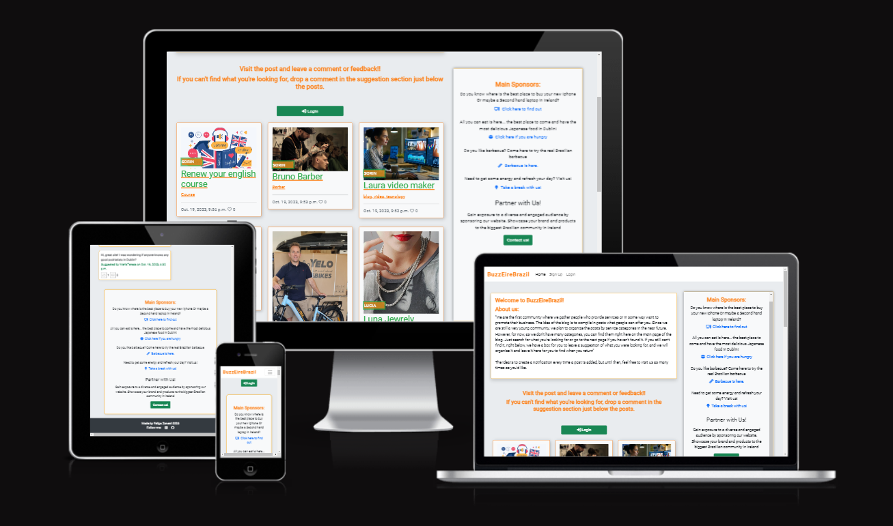

# BuzzEireBrazil


This blog was created to Brazilians living in Ireland, offering a platform for them to promote their businesses or professional services. Additionally, users can seek recommendations and assistance from others within the Brazilian community in Ireland. The primary objective of this project is to connect Brazilians living in Ireland with job opportunities and business prospects.

<br> 

If you want to check the lastest version of my Blog 

## [Click here](https://buzzeirebrazil-4d2838e0aec6.herokuapp.com/)


<br>

- 

```
Welcome to BuzzEireBrazil!
```


<details>
<summary>Goals</summary>

<h3>Please refer to my "User Stories in Agile" to check in details each topic in the Goals below</h3>

* Facilitating User Onboarding: We strive to make it effortless for new users to join our community. Creating a new user profile is a straightforward process, enabling users to quickly access and interact with others.

* Expanding the Community: Our platform aims to expand our user base continually. We encourage users to invite others to join the community, fostering connections and broadening the network. More users mean more opportunities for job postings, business promotion, and meaningful interactions.

* Enhancing User Engagement: We're committed to enhancing user engagement by allowing users to comment and provide feedback on existing blog posts. Users can share their thoughts and experiences, helping others make informed decisions about businesses and services.

* Endorsing Recommendations: Users have the power to recommend and endorse businesses or services they've had positive experiences with. This recommendation system builds trust within the community, allowing users to discover highly-rated businesses and services easily.

* Suggesting New Ideas: Our platform encourages users to suggest new features or content they'd like to see. By reading and posting suggestions, users have a direct say in shaping the platform and making it more responsive to their needs.

* Interacting with Posts and Suggestions: Users can engage with existing posts and suggestions by liking or disliking them. This interaction system helps surface the most valuable and relevant content within the community.

* Sponsorship Opportunities: For businesses seeking more visibility, our "Contact Us" feature enables them to explore sponsorship options. Becoming a sponsor allows businesses to showcase their services to a wider audience on the platform.

* Foster a supportive community environment for Brazilians living in Ireland.


</details>

<br>


# User Experience


<details>
<summary>Expectation of user</summary>

User experience is a central focus of this project. We aim to provide an intuitive and visually appealing interface that enhances user engagement. The website has been designed with the user in mind to ensure seamless navigation and accessibility.

* Get Started with Ireland Colors: When you first visit our website, you'll notice that it's designed with the colors of Ireland's flag. It's a warm welcome to Brazilians into the Irish community!

* User-Centric Design: Our project puts you, the user, first and foremost. We've built everything with your needs and preferences in mind to make sure it's easy for you to use.

* Easy to Get Around: Moving around the website is simple and doesn't require any special skills. You can easily go from one part of the website to another, whether you're reading blog posts, suggesting new ideas, or talking to other users.

* For Everyone: We've made sure that everyone can use our website, including people with disabilities. We've used special technology to make it easier for everyone to read and use the site.

* Works on Any Device: Whether you're using a computer, a tablet, or even a phone, our website will work great and look nice on your device.


</details>

<br>


<details>

<br>

<summary> Agile</summary>
Agile methodologies have been employed to manage and prioritize project tasks using GitHub Project Boards. Here's how we approached it:

1. **Theme Identification:** Initially, we created a spreadsheet to collect details categorized by themes, which helped us define epics. These themes include Account Management, Profile, Post Pool, Navigation, and Admin.

2. **Issue Template:** To expedite the addition of User Stories to the project, we developed an issue template.

3. **Repository Settings:** In the repository settings, we set up templates for features. The Issue Template provides developers with the necessary information to address MVP (Minimum Viable Product) points.

4. **Deployment process:** The project was developed using python and Django and was deployed using Debug = `False` 

<br>

</details>

<br>

<details>
<summary>User Stories in Agile</summary>


### We've structured our journey into achievable milestones to ensure we stay on track and deliver the best experience for you:

- 

 1. Start and deploying [#21](https://github.com/zanettiprado/BuzzEireBrazil/issues/21)

2. Setup & Basic Blog Functionality: This phase involves establishing the fundamental blog features, such as user registration and post creation.

    - USER STORY: Navigate Through Pages [#11](https://github.com/zanettiprado/BuzzEireBrazil/issues/11)

    - USER STORY: Browse Blog Entries [#4](https://github.com/zanettiprado/BuzzEireBrazil/issues/4)

    - USER STORY: Access a Post [#5](https://github.com/zanettiprado/BuzzEireBrazil/issues/5)
  
3. User Engagement & Interactivity: Here, we focus on enhancing user engagement through features like comments, likes, and sharing.

    - USER STORY: Profile Creation [#8](https://github.com/zanettiprado/BuzzEireBrazil/issues/8)

    - USER STORY: Participate in Post Discussion [#9](https://github.com/zanettiprado/BuzzEireBrazil/issues/9)

    - USER STORY: Engage with Content [#10](https://github.com/zanettiprado/BuzzEireBrazil/issues/10)

4. Admin Management & Content Creation: In this phase, we develop admin management tools and refine content creation features.

    - USER STORY: Content Administration [#11](https://github.com/zanettiprado/BuzzEireBrazil/issues/11)

    - USER STORY: Draft Posts `(NOT IMPLEMENTED)` [#12](https://github.com/zanettiprado/BuzzEireBrazil/issues/12)

    - USER STORY: Moderate Comment Section [#13](https://github.com/zanettiprado/BuzzEireBrazil/issues/13)
    
    - USER STORY: Search for Posts `(NOT IMPLEMENTED)` [#1](https://github.com/zanettiprado/BuzzEireBrazil/issues/1)

    - USER STORY: Allows to preview before posting `(NOT IMPLEMENTED)` [#14](https://github.com/zanettiprado/BuzzEireBrazil/issues/14)


5. Advanced User Features & Enhancements: This milestone concentrates on advanced user features and improvements to existing functionalities.

     - USER STORY: Search for Posts `(NOT IMPLEMENTED)` [#1](https://github.com/zanettiprado/BuzzEireBrazil/issues/1)

     - USER STORY: Notification Preferences `(NOT IMPLEMENTED)` [#2](https://github.com/zanettiprado/BuzzEireBrazil/issues/2)

     - USER STORY: Review Comment Section [#7](https://github.com/zanettiprado/BuzzEireBrazil/issues/7)

6. Testing & Quality Assurance: The final milestone emphasizes rigorous testing and quality assurance to ensure a stable and reliable platform.

    - Manual Testing Framework

    - Automated Unit Testing

    - UI/UX Testing

    - Performance Testing

</details>

<br>


# Design
<br>
<details>
<summary>Color Scheme</summary>

The color scheme was chosen to reflect the Irish flag and evoke a sense of Ireland:

- 
</details>

<br>

<details>
<summary>Mobile-Friendly Design</summary>


For mobile users, the website is optimized with a responsive design. The navigation menu is toggled to accommodate smaller screens, making it convenient for users on mobile devices.
- 


Authentication: Users who are not logged in can still browse and view posts. However, to participate by commenting or making suggestions, they must first log in. If a user doesn't have an account, they can easily sign up to become a part of the community.

- 
<br>

</details>

<br>


<details>
<summary>Typography</summary>
We've carefully chosen the "Secular One" font for our website.

<br>

The "Secular One" font was selected to enhance readability and visual appeal. Its clean and modern design ensures that content is easy to read, creating a more enjoyable browsing experience for our users. Additionally, this font complements our overall design aesthetic, making it a perfect fit for our platform. We believe that a visually pleasing and easily readable font contributes to a positive user experience.

</details>


<br>


<details>
<summary>Icons</summary>
Font Awesome icons have been used throughout the site, including for the buttons and social media links.
</details>

<br>


# Features


<br>

<details>
<summary>Pages and elements</summary>


1 - **Home Page**
The heart of the website, the home page, serves as a central hub where users can access a variety of key features. Here's what you'll find on the home page. The logo is also clickable.

2 - **List of Posts:** Users can view a comprehensive list of posts submitted by members of the Brazilian community in Ireland. These posts showcase various businesses, services, or job opportunities.


-  


3 - **Main Sponsors:** 
Prominent on every page, the "Main Sponsors" section highlights four businesses that have chosen to promote their services on the platform. This section offers visibility and recognition to these sponsors.

 * 3.1 
 <br>

 -  

 Clicking in the contact us button you will be redirect for a form to be filled in order to check how to become a sponsor.

 * 3.2  <br>
 
 - 

 After submitting the form you will get a message thanking you for your interest in become a sponsor
 
 * 3.3  <br>
 -  

4 - **List of Suggestions:** 
Users can discover and submit requests for assistance or recommendations. This section encourages community members to help one another by connecting individuals seeking specific services with those who can provide them.

- 

5 - **Post Details Page**
When a user clicks on a post from the list, they are directed to the "Post Details" page. Here, they can delve deeper into the specifics of a particular business or service. This page includes:

- 

6 - **Comments and Feedback:** Users can engage in discussions and provide feedback regarding the business or service. This interactive feature fosters communication and helps community members make informed decisions.

- 

7 - **Navigation**
The navigation bar, situated at the top of the website, provides easy access to essential features and functions. Users can find the following items in the navigation:

-  


8 - **Login/Logout:** Users can log in to their accounts or log out as needed. This functionality is crucial for accessing certain actions on the website.


9 - **Sign-In/Sign-on Page:**
The Sign-In page serves as the entry point for registered users to access their accounts. Key features of this page include:
 
 * 9.1  <br> 
 - 
 General view for large device

 * 9.2  <br> 
-  
- 

Full Page view 

* 9.3  <br> 
-  
- 

* 10 **Clickable Logo:** Clicking on the logo serves as an alternative way to return to the home page, ensuring intuitive navigation.

- 

* 11 **Footer**: footer is quite clean. It brings few elements. The information about the me and LinkedIn and GitHub link pages

- 

</details>

<br>

<details>
<summary>Future implementation </summary>


 1. List of Posts Sorted by Categories:
In upcoming versions, we will introduce a feature to categorize posts. This will make it easier for users to find content that interests them. Posts will be tagged with relevant categories, and users can filter posts by selecting a category from the navigation menu.

2. Search Bar on the Top of Post List:
To enhance user experience, we'll add a search bar at the top of the post list. Users can simply enter keywords or phrases related to their interests, and the system will display matching posts in real-time.

 3. Reply for Suggestions in Suggestion Section:
We are committed to fostering engagement within the community. In the next release, users will be able to reply to suggestions, providing feedback or offering assistance. This will create a more interactive and supportive environment.

 4. Reply for Comments in Post Details:
To encourage discussions, we will implement a comment reply feature. Users can respond to specific comments within a post's comment section, facilitating meaningful conversations.

 5. Rate with Star for Services in Post Details:
We aim to improve the way users evaluate services. Users will have the option to rate services with a star-based system, offering valuable feedback to service providers and helping other users make informed decisions.

 6. Feed with Updates in Another Page Like a Journal:
In future updates, we will introduce a dedicated page for updates and announcements. Users can access this journal-like feed to stay informed about the latest community news, events, and changes to the platform.

 7. Notification Preferences for User:
Personalization is key. Users will be able to customize their notification preferences. They can choose to receive updates related to specific categories, new posts, comments on their content, and more.

 8. Reset Password:
Password management is crucial. Users will have the option to reset their passwords securely through a password reset feature. This ensures account security and accessibility.

 9. Draft Post for Keeping Posts Saved:
We understand that not every post is meant for immediate publishing. Users can save drafts of their posts and return to them later for editing and publishing. This feature will ensure that no creative idea is lost.

</details>

<br>

<details>
<summary>Accessibility</summary>


Our commitment to accessibility is evident in every line of code. We've gone the extra mile to make our website as user-friendly as possible for everyone. Here's how we've achieved this:

- Semantic HTML: We've meticulously crafted our web pages using semantic HTML tags. This means that not only is our code clean and organized, but it also ensures that screen readers and assistive technologies can understand and navigate the content effortlessly.

- Descriptive Alt Attributes: Images on our site are more than just visuals; they're informative. We've provided detailed and meaningful alt attributes for every image. This empowers screen readers to convey the content accurately to users who rely on them.

- Icons with Text Descriptions: Icons can be confusing for some users. To make sure everyone understands their meaning, we've included text descriptions alongside icons where needed. This ensures that all users, regardless of their abilities, can interact with our site effectively.

- Color Contrast: We understand the importance of legibility. To that end, we've maintained a high level of color contrast throughout our site. This not only makes text and content easier to read but also ensures that our site is inclusive and accessible to all.

At BuzzEireBrazil, accessibility isn't an afterthought; it's an integral part of our development process. We believe that everyone should have a seamless and enjoyable experience on our platform, regardless of their abilities or assistive technologies.
</details>

<br>

# Technologies Used in the project

<br>

<details>
<summary>Languages</summary>


## 
- HTML: The foundation of our website, responsible for structuring the main site content. We have 13 HTML files in the project so far.
- CSS: Provides the styling and layout to create an attractive and user-friendly interface.
- JavaScript: Adds interactive elements and enhances user engagement.
- Python 3.8.11: The backbone of our back-end functionality, powering the server and business logic.
</details>

<br>

<details>
<summary>Databases Used</summary>

- ElephantSQL (Postgres database): Our reliable data storage solution. 
- Cloudinary: An online static file storage service for managing media assets.
</details>

<br>

<details>
<summary>Frameworks Used</summary>

- Django: A high-level Python web framework that streamlines development.
- Bootstrap (Version 5.2.3): A CSS framework that accelerates front-end design.
- Crispy Forms: Enhances form rendering for a more user-friendly experience.
</details>

<br>

<details>
<summary>Development Tools</summary>

- Pip: A vital tool for installing Python packages.
- Jinja: Our templating engine, facilitating dynamic content rendering.
- Balsamiq: Used for wireframing to plan out the site's layout and structure.
</details>


<br>

<details>
<summary>Version Control</summary>

- Git: The backbone of our version control system.
- GitHub: Our repository for saving and managing project files.
</details>

<br>

<details>
<summary>Development Environment</summary>

 
- Gitpod: A cloud-based integrated development environment (IDE) for seamless development.
</details>

<br>

<details>
<summary>Hosting and Deployment</summary>

Heroku: Hosting platform for the deployed back-end site.
</details>

<br>

<details>
<summary>Typography and Styling</summary>

 
- Google Fonts: Imported fonts to enhance site aesthetics.
</details>

<br>


<details>
<summary>Testing and Debugging</summary>

- Google Chrome Dev Tools: Essential for troubleshooting, testing, and ensuring responsiveness and styling.

- Am I Responsive?: Used to display website images on various devices.
</details>

<br>


# Deployment & Local Development

<br>

<details>
<summary>Fork the Repository</summary>


1. Log in or Sign up: Go to GitHub and log in with your account. If you don't have an account, sign up.
2. Navigate to the Repository: Go to the repository for your project (replace your-repo-name with the actual repository name). <br>
Click here [BuzzEireBrazil](https://github.com/zanettiprado/buzzeirebrazil)
```
https://github.com/zanettiprado/buzzeirebrazil
```

3 - Fork the Repository: Click the "Fork" button in the top right corner of the repository page. This will create a copy of the repository under your GitHub account.
</details>

<br>

<details>
<summary>Clone the Repository</summary>


## 
1. Log in to GitHub: If you're not already logged in, log in to GitHub.

2. Navigate to the Repository: Go to the repository for your project (replace your-repo-name with the actual repository name).<br>
Click here [BuzzEireBrazil](https://github.com/zanettiprado/buzzeirebrazil)
```
https://github.com/zanettiprado/buzzeirebrazil
```
3. Clone the Repository: Click on the "Code" button on the repository page. Select your preferred method for cloning: HTTPS, SSH, or GitHub CLI. Copy the provided link.

4. Open Terminal: Open your terminal (command prompt or Git Bash on Windows, Terminal on macOS, or any terminal emulator on Linux).

5. Change Directory: Use the cd command to navigate to the location where you want to store the cloned repository.

```
cd /path/to/your/directory
```
6. Clone the Repository: In your terminal, run the following command, pasting the link you copied from step 3:
</details>

<br>

<details>
<summary>Install Project Dependencies</summary>


1. Navigate to Project Directory: Ensure you are in the project directory where the `requirements.txt` file is located.

2. Install Dependencies: In your terminal, run the following command to install the required packages:

```
pip install -r requirements.txt
```
</details>

<br>

<details>
<summary>ElephantSQL Database</summary>

In this project, we use ElephantSQL to store our data in a special database called PostgreSQL. To get your own database, follow these steps:

1. Sign up using your GitHub account.
2. Click on "Create New Instance" to make a new database.
3. Give it a name (usually the project's name, like "tribe").
4. Choose the "Tiny Turtle (Free)" plan.
5. You can ignore the "Tags" part.
6. Pick a Region and Data Center that's closest to where you are.
7. Once it's created, click on the new database's name to see the database URL and Password. You'll need these later.

</details>

<br>

<details>
<summary>Cloudinary API</summary>


We use the Cloudinary API in our project to keep our pictures and videos online because Heroku, where we host our project, doesn't save this kind of data. Here's how to get your own Cloudinary API key:

1. Create an account and log in to Cloudinary.
2. When they ask what you're interested in, pick "Programmable Media" because it's about images and videos.
3. If you want, change your cloud name to something you can remember easily.
4. On your Cloudinary Dashboard, you'll find your API Environment Variable. It looks like a long code.
5. Make sure to remove the "CLOUDINARY_URL=" part from the code because that part is your key.

</details>

<br>

<details>
<summary>Heroku Account and dployment</summary>

<br>

1. Set Up Your Heroku Account

If you don't have a Heroku account, sign up for one at https://www.heroku.com/. It's free to get started.

2. Install Heroku CLI

Download and install the Heroku Command Line Interface (CLI) for your operating system. You can find installation instructions here: https://devcenter.heroku.com/articles/heroku-cli

3. Log In to Heroku

Open your terminal or command prompt and log in to Heroku by running:
```
heroku login
```
Follow the prompts to enter your Heroku credentials.

4. Initialize a Git Repository

If your project isn't already in a Git repository, you'll need to initialize one. Navigate to your project's root directory in the terminal and run:

```
git init
git add .
git commit -m "Initial commit"
```
5. Create a requirements.txt File

If you don't already have a requirements.txt file, create one. This file lists all the Python packages required for your project. You can generate it by running:
```
pip freeze > requirements.txt
```
6. Create a Procfile

Create a file named Procfile (without any file extension) in your project's root directory. This file tells Heroku how to run your application. Inside the Procfile, add:

```
web: python your_app_name/manage.py runserver 0.0.0.0:$PORT
```
7. Install Gunicorn

Gunicorn is a WSGI HTTP server for Python applications. Install it by running:
```
pip install gunicorn
```

8. Add Heroku Buildpacks
Heroku uses buildpacks to determine how to build and run your application. You'll need to add Python and Node.js buildpacks if your project uses JavaScript or CSS. Run the following commands to add buildpacks:
```
heroku buildpacks:add heroku/python
```
9. Set Environment Variables

Set the environment variables in Heroku that you mentioned earlier. You can do this by running:
```
heroku config:set CLOUDINARY_URL=your_cloudinary_api_key
heroku config:set DATABASE_URL=your_database_url
heroku config:set DISABLE_COLLECTSTATIC=1
heroku config:set SECRET_KEY=your_secret_key 
```

Replace your_cloudinary_api_key, your_database_url, and your_secret_key with your actual keys and URLs.

10. Deploy to Heroku

Now it's time to deploy your project to Heroku. Run:
``` 
git push heroku master
```

This command will push your code to Heroku's servers and trigger the deployment process.

11. Run Migrations

After deploying, run the following command to apply database migrations:
``` 
heroku run python manage.py migrate 
```

12. Open Your App

Your app should be deployed and live on Heroku now! You can open it in your browser using
``` 
heroku open
```

</details>

<br>

# Testing

<br>

<details>
<summary>Responsiveness testing </summary>

Test to ensure a consistent user experience across various platforms (desktop, tablet, mobile). 

Our website/application has been thoroughly tested for responsiveness, and it performs exceptionally well across various screen sizes and devices, ensuring a seamless user experience.


As infomered we have used Am I responsive web page to get the below image.



</details>

<br>

<details>
<summary>Browser Compatibility Testing </summary>


We have verified that our project functions flawlessly on multiple web browsers, including Chrome, Firefox, Safari, and Internet Explorer.

Bugs Resolved and Unresolved: All identified issues and bugs have been diligently 
</details>

<br>

<details>
<summary>Code Validation</summary>


## 
The codebase adheres to industry standards and best practices, ensuring error-free, well-structured, and convention-following code.
</details>

<br>


<details>
<summary>Automated Tests </summary>


### Automated testing scripts have been employed to streamline our testing process, resulting in consistent and efficient testing outcomes. We ran tests for Models.py, Views.py and Forms.py in three differents files. 


## Forms Validation Tests

## 1. test_post_form_valid_data
#### Purpose: 
This test checks if the form for creating a post can tell when you give it the right information.
#### How It Works: 
It pretends to fill out the form with the correct info, like a post title and content. Then, it checks if the form thinks everything is good (valid).
#### Result We Want:
 We hope this test passes, which means the form knows when you're giving it the right details.


## 2. test_comment_form_valid_data


#### Purpose: 
This test checks if the form for making comments can recognize when you provide the right data.
#### How It Works:
 It pretends to fill out the comment form with proper information, like the comment text. Then, it checks if the form says everything is okay (valid).
#### Result We Want:
 We expect this test to pass, showing that the comment form can tell when you're giving it the right data.


## 3. test_user_suggestion_form_valid_data


#### Purpose: 
This test checks if the form for user suggestions can tell when you provide it with the correct details.
#### How It Works:
 It pretends to fill out the suggestion form with good data, like the suggestion text. Then, it checks if the form thinks it's all right (valid).
#### Result We Want:
 We want this test to pass, meaning the suggestion form can recognize when you're giving it the right information.


## 4. test_sponsorship_contact_form_valid_data
#### Purpose:
 This test checks if the form for sponsorship contact can recognize when you give it the right info.
#### How It Works:
 It pretends to fill out the sponsorship contact form with proper data, like the name and email. Then, it checks if the form believes everything is fine (valid).
#### Result We Want:
 We anticipate this test to pass, showing that the sponsorship contact form can identify when you're providing the right information.


<br>


## Models Validation Tests

## 1. test_title_max_length

### Purpose:
 This test checks if the title of a post can't be too long.
#### How It Works:
 It pretends to create a post with an extra-long title and then sees if the title is as long as it should be.
#### Result We Want:
 We hope this test passes, which means our posts have a limit on how long their titles can be.

## 2. test_object_name_is_title
#### 
Purpose: This test checks if the name of a post object is the same as its title.
#### How It Works:
 It pretends to create a post and then compares the post's name to what the title should be.
##### Result We Want:
 We expect this test to pass, showing that our posts have their names set to their titles.


<br>


## Testing Validation Views

## 1. Create Post View Test (test_create_post_view):

#### 1. It logs in as a test user.
Sends a GET request to the 'create_post' URL.
Checks if the response status code is 200 (OK).
Verifies that the 'create_post.html' template is used.
Post Like View Test (test_post_like_view):

#### 2. Logs in as a test user.
Sends a POST request to the 'post_like' URL for a post.
Checks if the response status code is 302 (a redirect).
Post Detail View Test (test_post_detail_view):

#### 3. Sends a GET request to the 'post_detail' URL for a post.
Checks if the response status code is 200 (OK).
Verifies that the 'post_detail.html' template is used.
Edit Post View Test (test_edit_post_view):

##### 4. Logs in as a test user.
Sends a GET request to the 'edit_post' URL for a post.
Checks if the response status code is 200 (OK).
Verifies that the 'edit_post.html' template is used.
Delete Post View Test (test_delete_post_view):

##### 5. Logs in as a test user.
Sends a GET request to the 'delete_post' URL for a post.
Checks if the response status code is 200 (OK).
Verifies that the 'delete_post.html' template is used.
Suggestion Dislike View Test (test_suggestion_dislike_view):

#### 6. Logs in as a test user.
Sends a POST request to the 'suggestion_dislike' URL for a suggestion.
Checks if the response status code is 302 (a redirect).
Edit Suggestion View Test (test_edit_suggestion_view):

#### 7. Logs in as a test user.
Sends a GET request to the 'edit_suggestion' URL for a suggestion.
Checks if the response status code is 200 (OK).
Verifies that the 'edit_suggestion.html' template is used.


</details>


<br>

<details>
<summary>Manual Features Testing</summary>


| Page | User Action | Expected Result| Notes |
| --- | --- | --- | --- |
|  **Home Page**   |  |  | |
| Landing - unlogged user | Click on Logo | Redirection to Home page | Pass |
| | Click on Login button  | Redirection to Sign In page | Pass |
| | Click on Sign Up button  | Redirection to Sign Up page | Pass |
| | Click on Post card  | Redirection to Post Details page | Pass |
| | Click on Next button | Redirection to Next page | Pass |
| | Click on Prev button | Redirection to Previous page | Pass |
| | Click on Contact us! button | Redirection to Contact Us for Sponsorship | Pass |
| Landing - logged user | Click on Logo | Redirection to Home page | Pass |
| | Click on Logout button  | Redirection to Home page | Pass |
| | Click on Post card  | Redirection to Post Details page | Pass |
| | Click on Next button | Redirection to Next page | Pass |
| | Click on Prev button | Redirection to Previous page | Pass |
| | Click on Contact us! button | Redirects user to Contact Us for Sponsorship | 
| | Suggestion text box | Change the text message to clean box | Pass |
| | Submit button new suggestion | Redirects user to home with a new list of suggestion | Pass |
| | Create a new Post button | Redirects user to create post form | Pass |
| | Create a new Post button | Redirects user to create post form | Pass |
| **Sign Up** |  |  |  |
| | Enter Username | Field accept any username | Pass |
| | Enter valid password (twice) | Field will only accept password format | Pass |
| | Click Sign Up button on sign up page  | Redirects Home page | Pass |
| | Click on Sign In link | Redirection to Sign In page | Pass |
| **Sing In** |  |  |  |
| | Enter User name | Field accept any username | Pass |
| | Enter valid password | Field will only accept password format | Pass |
| | Click Login button on login page | Redirects user to Home page | Pass |
| **Sing Out** |  |  |  |
| | Click Logout | Redirects to Home page | Pass |
| **Navigation bar** | | | | 
| | Logo, Home, (Login), Logout | Button tested above| Pass | 
| **Post card** | | | | 
| | Card button |Return the orignal post for view only | Pass | 
| **Edit Post** | | | | 
| | Edit post button |Return the orignal post for editing all details again | Pass | 
| | Save Change button | User will be redirected to edited post | Pass | 
| **Delete Post** | | | | 
| | Click on the Delete button | Post will be permanently deleted | Pass |  
| **Post details page** | | | | 
|Looged user | Like post heart button |Return the orignal post showing a red heart and updated likes counter | Pass | 
| | Comment box |Give a option to user post a comment or feedback in the post | Pass | 
| | Submit button Comment box |Return the orignal post showing a new comment and updated comment counter | Pass | 
| **Post details page** | | | | 
|Unlooged user | Login button |Return the user to login page | Pass |
| **Edit Suggestion** | | | | 
| | Edit post button |Return the orignal suggestion for editing all details again | Pass | 
| | Save Change button | User will be redirected to Home | Pass | 
| **Delete Suggestion** | | | | 
| | Click on the Delete button | Suggestion will be permanently deleted | Pass |  
| **Sidebar** | | | | 
| | Click on Contact us! button | Redirects user to Contact Us for Sponsorship | 
| **Contact Us for Sponsorship** | | | | 
| | Filed name, Email address and Type of business | Redirects user to Contact Us for Thank You for Contacting Us! page | 
| **Footer** | | | | 
| | LinkedIn logo | Redirects user to my linkedIn | Pass | 
| | GitHub logo | Redirects user to my GitHub page | Pass | 

</details>

<br>

# Credits and References

<details>
<summary>References</summary>


* [Code Institute](https://learn.codeinstitute.net/dashboard) 

* [Pip instalation ](https://pip.pypa.io/en/stable/installation/) 

* [Cental Django](https://djangocentral.com/building-a-blog-application-with-django/)

* [GitHub Documentation](https://docs.github.com/en/get-started/writing-on-github/working-with-advanced-formatting/)

* [Collapsed sections](https://docs.github.com/en/get-started/writing-on-github/working-with-advanced-formatting/organizing-information-with-collapsed-sections)

* [Bootstrap](https://getbootstrap.com/docs/5.3/getting-started/introduction/)

* [Allauth](https://docs.allauth.org/en/latest/)

* [Cloudinary documentation ](https://cloudinary.com/documentation/diagnosing_error_codes_tutorial)

* [Djangoproject testing](https://docs.djangoproject.com/en/4.2/topics/testing/tools/#django.test.Client.get)

* [Rocket validator ](https://rocketvalidator.com/d/f22a1876-43ee-4e70-a3bc-ebc7afa2767a)

* [Python validator](https://pep8ci.herokuapp.com/#)

* [ Markup Validation Service](https://validator.w3.org/#validate_by_input)

* [CSS Validation Service](https://jigsaw.w3.org/css-validator/)

## Disclaimer:
For the installation and initial setup of this project, we drew inspiration from two valuable resources:

1. The "I think therefore I blog" project from Code Institute.
2. The tutorial on building a blog application with Django available at Django Central.
These resources provided foundational insights and guidance in implementing key features of our project. While we have customized and expanded upon these foundations to meet the specific needs of our platform, we acknowledge and appreciate the contribution of these resources to our development process. We thank Code Institute and Django Central for sharing their knowledge and making it accessible to the developer community.

</details>

<br>

# Author
Felipe Zanetti - Project Milestone 4 for Course Institute


