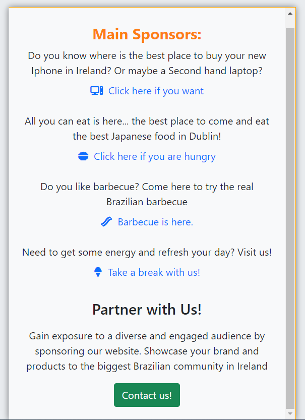

# BuzzEireBrazil


```
Welcome to BuzzEireBrazil!
```

This blog was created to Brazilians living in Ireland, offering a platform for them to promote their businesses or professional services. Additionally, users can seek recommendations and assistance from others within the Brazilian community in Ireland. The primary objective of this project is to connect Brazilians living in Ireland with job opportunities and business prospects.

## Goals
* Facilitate connections and networking among Brazilians in Ireland, specifically focusing on job and business opportunities.
* Create a user-friendly and inclusive platform where users can easily share and discover professional services.
* Foster a supportive community environment for Brazilians living in Ireland.

# User Experience

* User experience is a central focus of this project. We aim to provide an intuitive and visually appealing interface that enhances user engagement.
* The website has been designed with the user in mind to ensure seamless navigation and accessibility.

## Agile
Agile methodologies have been employed to manage and prioritize project tasks using GitHub Project Boards. Here's how we approached it:

1. **Theme Identification:** Initially, we created a spreadsheet to collect details categorized by themes, which helped us define epics. These themes include Account Management, Profile, Post Pool, Navigation, and Admin.

2. **Issue Template:** To expedite the addition of User Stories to the project, we developed an issue template.

3. **Repository Settings:** In the repository settings, we set up templates for features. The Issue Template provides developers with the necessary information to address MVP (Minimum Viable Product) points.

4. **Deployment process:** The project was developed using python and Django and was deployed using Debug = `False` 

## User Stories in Agile
We've organized the project into the following milestones:


 1. Start and deploying

2. Setup & Basic Blog Functionality: This phase involves establishing the fundamental blog features, such as user registration and post creation.

    - USER STORY: Navigate Through Pages

    - USER STORY: Browse Blog Entries

    - USER STORY: Access a Post
  
3. User Engagement & Interactivity: Here, we focus on enhancing user engagement through features like comments, likes, and sharing.
    - USER STORY: Profile Creation

    - USER STORY: Participate in Post Discussion

    - USER STORY: Engage with Content

4. Admin Management & Content Creation: In this phase, we develop admin management tools and refine content creation features.
    - USER STORY: Content Administration

    - USER STORY: Draft Posts `(NOT IMPLEMENTED)`

    - USER STORY: Moderate Comment Section
    
    - USER STORY: Search for Posts `(NOT IMPLEMENTED)`

    - USER STORY: Allows to preview before posting `(NOT IMPLEMENTED)`


5. Advanced User Features & Enhancements: This milestone concentrates on advanced user features and improvements to existing functionalities.

     - USER STORY: Search for Posts `(NOT IMPLEMENTED)`

     - USER STORY: Notification Preferences `(NOT IMPLEMENTED)`

     - USER STORY: Review Comment Section 

6. Testing & Quality Assurance: The final milestone emphasizes rigorous testing and quality assurance to ensure a stable and reliable platform.

    - Manual Testing Framework

    - Automated Unit Testing

    - UI/UX Testing

    - Performance Testing


# Design
## Color Scheme
The color scheme was chosen to reflect the Irish flag and evoke a sense of Ireland:


## Typography
We've selected the `"Secular One"` font for the website. 

## Icons
Font Awesome icons have been used throughout the site, including for the buttons and social media links.

# Features
## Pages

**Home Page**
The heart of the website, the home page, serves as a central hub where users can access a variety of key features. Here's what you'll find on the home page. The logo is also clickable.

**List of Posts:** Users can view a comprehensive list of posts submitted by members of the Brazilian community in Ireland. These posts showcase various businesses, services, or job opportunities.


 


**Main Sponsors:** 
Prominent on every page, the "Main Sponsors" section highlights four businesses that have chosen to promote their services on the platform. This section offers visibility and recognition to these sponsors.



**List of Suggestions:** 
Users can discover and submit requests for assistance or recommendations. This section encourages community members to help one another by connecting individuals seeking specific services with those who can provide them.


**Post Details Page**
When a user clicks on a post from the list, they are directed to the "Post Details" page. Here, they can delve deeper into the specifics of a particular business or service. This page includes:


**Comments and Feedback:** Users can engage in discussions and provide feedback regarding the business or service. This interactive feature fosters communication and helps community members make informed decisions.


**Navigation**
The navigation bar, situated at the top of the website, provides easy access to essential features and functions. Users can find the following items in the navigation:

 


**Login/Logout:** Users can log in to their accounts or log out as needed. This functionality is crucial for accessing certain actions on the website.


**Sign-In/Sign-on Page:**
The Sign-In page serves as the entry point for registered users to access their accounts. Key features of this page include:


 
 
 General view for large devices

 


Full Page view 

 


**Clickable Logo:** Clicking on the logo serves as an alternative way to return to the home page, ensuring intuitive navigation.


### Mobile-Friendly Design

For mobile users, the website is optimized with a responsive design. The navigation menu is toggled to accommodate smaller screens, making it convenient for users on mobile devices.

Authentication: Users who are not logged in can still browse and view posts. However, to participate by commenting or making suggestions, they must first log in. If a user doesn't have an account, they can easily sign up to become a part of the community.


